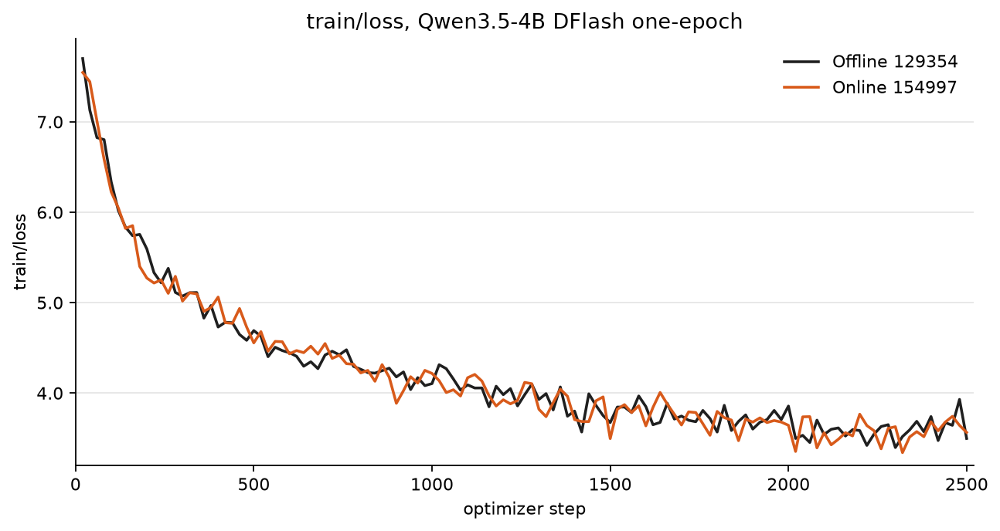
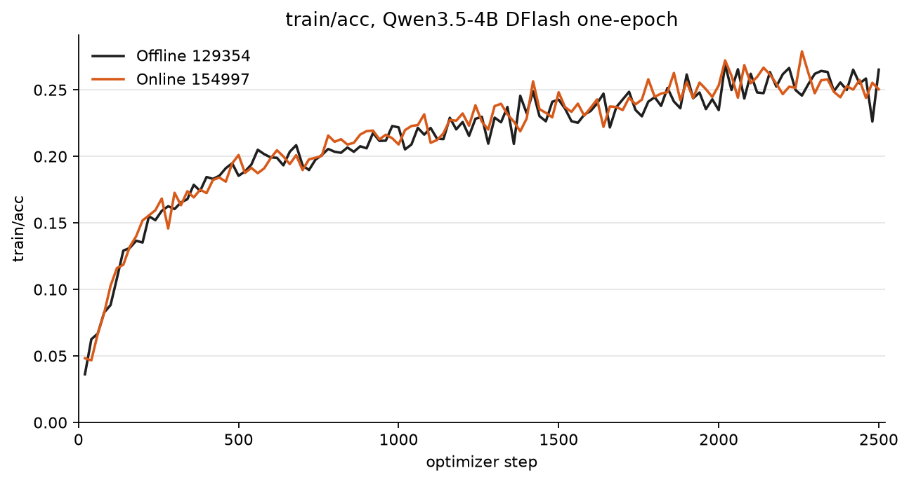

# SpecForge on Primus

`primus-cli` is the entrypoint for SpecForge **capture** and **draft training**.
SpecForge still owns data prep, draft configs, export, and SGLang serving —
follow the
[SpecForge AMD ROCm tutorial](https://github.com/sgl-project/SpecForge/blob/main/docs/sections/basic_usage/AMD/amd_rocm.md)
for those steps.

## Intro

Two knobs:

| Knob | Values | Meaning |
| --- | --- | --- |
| `specforge_mode` | `train` \| `capture` | Which program Primus runs (`train` if omitted) |
| `specforge_train_mode` | `online` \| `offline` | How train runs. **Required** when mode is `train` (no default). Ignored for capture. |

`offline` train is `specforge train` on pre-captured hidden states. `online`
train is live Mooncake + SGLang capture plus `--role producer` / `--role
consumer`. Capture is SpecForge `scripts/prepare_hidden_states.py`, not a
train mode.

Build and run the overlay: [`docker/README.md`](docker/README.md). Inside the
container, Primus is `/opt/primus` and SpecForge is `/workspace/SpecForge`.

From `/opt/primus`:

```bash
./runner/primus-cli direct -- train pretrain --config <experiment.yaml>
```

Same command for capture and train; only the YAML changes. Dotted CLI keys
override YAML, for example `specforge_overrides.training.max_steps=1000`.
The [configuration reference](#configuration-reference) lists every Primus
YAML field, env var, and CLI option; SpecForge-owned knobs stay in the
[SpecForge AMD ROCm tutorial](https://github.com/sgl-project/SpecForge/blob/main/docs/sections/basic_usage/AMD/amd_rocm.md).

## Offline

Capture, then train on disk hidden states. Example pair for Qwen3.5-4B DFlash
(20-step smoke defaults).

**Capture** — `specforge_mode: capture` runs SpecForge
`scripts/prepare_hidden_states.py`:

```yaml
# examples/specforge/configs/qwen3.5-4b-dflash-offline-capture.yaml
modules:
  pre_trainer:
    framework: specforge
    overrides:
      specforge_mode: capture
      specforge_root: ${SPECFORGE_ROOT:/workspace/SpecForge}
      specforge_capture:
        target_model_path: ${TARGET_MODEL:Qwen/Qwen3.5-4B}
        data_path: ${CAPTURE_DATA_PATH}
        output_path: ${OUTPUT_DIR}/hidden_states_raw
        nproc_per_node: ${NPROC_PER_NODE:1}
        sglang_attention_backend: aiter
        sglang_disable_radix_cache: true
```

```bash
cd /opt/primus
export CAPTURE_DATA_PATH=/data/sharegpt.jsonl
export OUTPUT_DIR=/data/runs/capture
export NPROC_PER_NODE=8
./runner/primus-cli direct -- train pretrain \
  --config examples/specforge/configs/qwen3.5-4b-dflash-offline-capture.yaml
```

**Train** — `specforge_mode: train` with `specforge_train_mode: offline`.
`specforge_config` points at SpecForge’s YAML; Primus forwards overrides onto
`specforge train`:

```yaml
# examples/specforge/configs/qwen3.5-4b-dflash-offline.yaml
modules:
  pre_trainer:
    framework: specforge
    overrides:
      specforge_mode: train
      specforge_train_mode: offline
      specforge_config: ${SPECFORGE_CONFIG:/workspace/SpecForge/examples/configs/offline/colocated/qwen3.5-4b-dflash-offline-amd.yaml}
      specforge_root: ${SPECFORGE_ROOT:/workspace/SpecForge}
      specforge_overrides:
        training.max_steps: ${MAX_STEPS:20}
        data.hidden_states_path: ${HIDDEN_STATES_PATH}
        deployment.trainer.nproc_per_node: ${NPROC_PER_NODE:1}
```

```bash
cd /opt/primus
export HIDDEN_STATES_PATH=/data/runs/capture/hidden_states
export OUTPUT_DIR=/data/runs/train
export NPROC_PER_NODE=8
export MAX_STEPS=20
./runner/primus-cli direct -- train pretrain \
  --config examples/specforge/configs/qwen3.5-4b-dflash-offline.yaml
```

## Online

`specforge_mode: train` with `specforge_train_mode: online` is live
capture+train. SpecForge's own CLI will not start Mooncake/SGLang across
nodes, so Primus does that and then launches `--role producer` /
`--role consumer`.

Run `./runner/primus-cli slurm` **outside** the image (login node, this
checkout). Training runs **inside** the overlay, or a bind-mount of this tree
at `/opt/primus`.

Example:
[`configs/qwen3.5-4b-dflash-online-2node.yaml`](configs/qwen3.5-4b-dflash-online-2node.yaml).
Primus maps `specforge_online.run_root` / `consumer_state_dir` onto SpecForge
`control_dir`, `output_dir`, and `consumer_state_dir`. After allocate it
rewrites the SpecForge loopback endpoints to a routable capture-rank-0 IP.
`PRIMUS_SPECFORGE_HEAD_IP` / `HEAD_IP` apply **only on capture rank 0**
(Mooncake + producer). Capture replicas and trainers advertise
`PRIMUS_SPECFORGE_LOCAL_IP` if set, else the IPv4 on
`PRIMUS_SPECFORGE_BIND_IFACE`, else hostname. A job-wide `HEAD_IP` must not be
the per-node Mooncake hostname. Shared vs local directories, empty
control/SQLite trees, and the producer/consumer contract are SpecForge's — see
[online disaggregated training](https://github.com/sgl-project/SpecForge/blob/main/docs/sections/basic_usage/AMD/amd_rocm.md#4-online-disaggregated-training).

One Slurm allocation, the same `primus-cli` command on every node. Shape is
**C capture nodes + T trainer nodes** (`CAPTURE_NNODES` + `TRAINER_NNODES`,
default 1+1 so `-N 2`):

| Slurm `NODE_RANK` | Role |
| --- | --- |
| `0 .. C-1` | Capture: SGLang on GPU. Rank 0 also starts Mooncake and the SpecForge **producer** (CPU HTTP client to those servers). |
| `C .. C+T-1` | Wait for `inference.ready` → `--role consumer` (`--node-rank` when `T>1`) |

```yaml
# examples/specforge/configs/qwen3.5-4b-dflash-online-2node.yaml
modules:
  pre_trainer:
    framework: specforge
    overrides:
      specforge_mode: train
      specforge_train_mode: online
      specforge_config: ${SPECFORGE_CONFIG:/workspace/SpecForge/examples/configs/online/disaggregated/external/qwen3.5-4b-dflash-online-amd.yaml}
      specforge_root: ${SPECFORGE_ROOT:/workspace/SpecForge}
      specforge_online:
        run_id: ${RUN_ID}
        run_root: ${RUN_ROOT}
        consumer_state_dir: ${CONSUMER_STATE_DIR}
        capture_nnodes: ${CAPTURE_NNODES:1}
        trainer_nnodes: ${TRAINER_NNODES:1}
        server_count: ${SERVER_COUNT:1}
        server_tp: ${SERVER_TP:1}
        trainer_nproc: ${NPROC_PER_NODE:1}
```

```bash
export RUN_ID=$(date -u +%Y%m%dT%H%M%SZ)
export RUN_ROOT=/path/to/shared/run/$RUN_ID
export OUTPUT_DIR=$RUN_ROOT/output
export CONSUMER_STATE_DIR=/path/to/local/nvme/specforge/$RUN_ID/consumer-state
export TRAIN_DATA_PATH=/path/to/sharegpt_train.jsonl
export MAX_STEPS=20
cd /opt/primus
./runner/primus-cli slurm srun -N 2 \
  --gres=gpu:1 \
  -- container --image primus-specforge:v0.5.14-rocm700-mi35x \
  --volume /shared:/shared \
  -- train pretrain \
  --config examples/specforge/configs/qwen3.5-4b-dflash-online-2node.yaml
```

The example above is **1 capture GPU + 1 trainer GPU** on 2 nodes. Load the
overlay image on **every** node if the scheduler's container store is
node-local. Do not wrap this in `managed_local` or `--role both`. SpecForge
`deployment.trainer.nnodes` is `TRAINER_NNODES` (consumer nodes only).
`server_gpus` / `trainer_gpus` default to `0`; a single device id expands to
`0..N-1` (`N = server_count * server_tp` or `trainer_nproc`), so 8+8 only
needs `SERVER_COUNT=8` and `NPROC_PER_NODE=8`. Set an explicit CSV to pin
non-contiguous devices. Raise `-N` with `CAPTURE_NNODES` / `TRAINER_NNODES`
for more nodes.

## Configuration reference

Set a Primus-owned value in experiment YAML under
`modules.pre_trainer.overrides`, or as a dotted CLI key after `--config`
(`specforge_online.server_count=8`). CLI merges into the module and wins over
YAML. Python env aliases are fallbacks only: they apply when the YAML/CLI
field is unset (`run_id` ← `RUN_ID`).

Example YAMLs also use Primus interpolation `${VAR:default}`. That expands
when the experiment file is loaded. It is **not** Hydra, and it does **not**
work in a top-level `env:` block — see
[Environment and XLA flags](../../docs/02-user-guide/environment-and-xla-flags.md).
A name that only appears inside `${…}` (for example `SERVER_COUNT`,
`MOONCAKE_LEASE_TTL_MS`, `MAX_STEPS`) is a no-op unless the YAML field
interpolates it.

Generic Primus envelope (`work_group`, `exp_name`, `workspace`,
`modules.pre_trainer.config`, `model:`) is the same as other backends.
Generic launcher flags are
[CLI reference](../../docs/02-user-guide/cli-reference.md).

SpecForge-owned knobs — draft architecture, data format, optimizer,
`training.*`, `runtime.in_flight_*`, `prepare_hidden_states.py` flags,
`specforge export`, SGLang serving — stay in the
[SpecForge AMD ROCm tutorial](https://github.com/sgl-project/SpecForge/blob/main/docs/sections/basic_usage/AMD/amd_rocm.md)
(especially §4 for online disaggregated). Do not duplicate them here.

### Primus module YAML

Under `modules.pre_trainer.overrides`. Module presets are
`primus/configs/modules/specforge/offline.yaml` and `online.yaml`.

| Field | Required | Default | Meaning |
| --- | --- | --- | --- |
| `specforge_mode` | no | `train` | `train` or `capture` |
| `specforge_train_mode` | **yes** when mode is `train` | none | `online` or `offline`. Ignored for capture |
| `specforge_config` | train | none | Path to SpecForge Hydra YAML. Example YAMLs interpolate `SPECFORGE_CONFIG` |
| `specforge_root` | no | `SPECFORGE_ROOT`, else ancestor of `specforge_config` | SpecForge checkout (cwd). Overlay default `/workspace/SpecForge`. Prepare hook: `--backend_path` then this field then `SPECFORGE_ROOT` |
| `specforge_entrypoint` | no | `specforge` | argv[0] for `specforge train` |
| `specforge_role` | no | omit | Rank split assigns producer/consumer. `both` is rejected. Do not pass `--role` on `primus-cli` |
| `output_dir` | no | none | Checkpoints / logs. Example YAMLs interpolate `OUTPUT_DIR`. Online also injects this into SpecForge Hydra |
| `specforge_overrides` | no | `{}` | Nested or dotted keys forwarded to `specforge train … key=value`. **SpecForge-owned** |
| `specforge_capture` | capture | `{}` | Offline hidden-state capture. Primus-owned keys below; the rest are SpecForge script flags |
| `specforge_online` | online train | `{}` | Mooncake / SGLang / rank split. Primus-owned |

`modules.pre_trainer.framework` must be `specforge`. `model:` points at a
Primus model preset (`qwen3.5-4b-dflash.yaml`); draft architecture still
lives in SpecForge.

### `specforge_online`

Read by `online_settings()`. YAML wins over the Python env alias. Names in
the **Env** column are read in Python; names only in example YAML
(`${SERVER_COUNT:1}`) are listed in [Interpolation-only names](#interpolation-only-names).

| YAML key | Python env | Default | Meaning |
| --- | --- | --- | --- |
| `run_id` | `RUN_ID`, `DISAGG_STORE_ID` | **required** | Store / run identity |
| `run_root` | `RUN_ROOT`, `DISAGG_RUN_ROOT` | **required** | Shared control dir (`head.ip`, `trainer.ip`, `inference.done`) |
| `consumer_state_dir` | `CONSUMER_STATE_DIR`, `DISAGG_CONSUMER_STATE_DIR` | **required** | Trainer-local consumer state (node-local disk) |
| `capture_nnodes` | `CAPTURE_NNODES` | `1` | Capture ranks: `[0, capture_nnodes)` |
| `trainer_nnodes` | `TRAINER_NNODES` | `1` | Trainer ranks: the rest of `-N` |
| `server_count` | — | `1` | SGLang servers per capture node |
| `server_tp` | — | `1` | Tensor parallel size per server |
| `server_gpus` | — | `0` | GPU list for SGLang. A single id expands to `0..(server_count×server_tp−1)` |
| `trainer_gpus` | — | `0` | GPU list for FSDP. A single id expands to `0..(nproc−1)` |
| `trainer_nproc` | `NPROC_PER_NODE` | `1` | Trainer processes per trainer node. YAML alias: `nproc_per_node` |
| `target_model_path` | `TARGET_MODEL` | `Qwen/Qwen3.5-4B` | Also falls back to `specforge_overrides.model.target_model_path` |
| `capture_layer_ids` | `CAPTURE_LAYER_IDS` | SpecForge `configs/qwen3.5-4b-dflash.json` `target_layer_ids`, else `1,8,15,22,29` | `--spec-capture-layer-ids` |
| `server_port` | — | `30000` | First SGLang HTTP port; remaining servers use `port+i` |
| `server_mem_fraction` | — | `0.85` | `--mem-fraction-static` |
| `sglang_extra_args` | — | `--attention-backend aiter --disable-radix-cache` | Extra argv on every SGLang server |
| `mooncake_protocol` | `MOONCAKE_PROTOCOL` | `tcp` | Injected as `deployment.disaggregated.mooncake_protocol` |
| `mooncake_lease_ttl_ms` | `MOONCAKE_DEFAULT_KV_LEASE_TTL` | `500` | `--spec-capture-kv-lease-ttl-ms` |
| `mooncake_rpc_port` | — | `35551` | Mooncake master RPC |
| `mooncake_http_port` | — | `35880` | Mooncake HTTP metadata |
| `mooncake_metrics_port` | — | `35903` | Mooncake metrics |
| `bind_interface` | `PRIMUS_SPECFORGE_BIND_IFACE` | unset | NIC used to derive a bind IP |
| `start_timeout_s` | `START_TIMEOUT_S` | `1800` | Sidecar start wait |
| `peer_timeout_s` | `PEER_TIMEOUT_S` | `1800` | Injected as `idle_timeout_s` and `peer_wait_timeout_s` |

Online allocation: `NNODES = capture_nnodes + trainer_nnodes`. Rank 0 starts
Mooncake and the SpecForge producer; other capture ranks start SGLang only;
trainer ranks run `--role consumer`.

### `specforge_capture`

Primus keys (not forwarded to SpecForge):

| YAML key | Meaning |
| --- | --- |
| `nproc_per_node` | `torchrun --nproc_per_node` for capture |
| `torchrun` / `script` | Override the launcher / `prepare_hidden_states.py` path |
| `filter_output_path` | After capture, Primus filters shards here |
| `filter_block_size` | Filter block size (example default `16`) |
| `filter_min_kept` | Minimum shards that must survive the filter (code default `1`) |

Every other key is forwarded as `--kebab-case` to SpecForge
`scripts/prepare_hidden_states.py`. Boolean flags use
`argument_builder.CAPTURE_STORE_TRUE`. Flag meanings are SpecForge's; see
the tutorial.

Preflight requires `data_path` (or `CAPTURE_DATA_PATH`), `output_path`, and
a readable `draft_model_config`. `sglang_disable_radix_cache` must stay true
on this overlay.

### SpecForge Hydra (`specforge_overrides` and `specforge_config`)

Put training hyperparameters in SpecForge's YAML or in `specforge_overrides`.
Primus **appends** the following Hydra keys after `specforge_overrides`, so
they win on collision. Keep loopback placeholders in the git SpecForge YAML;
do not put allocated IPs there.

| SpecForge key | Primus sets |
| --- | --- |
| `model.target_model_path` | `specforge_online.target_model_path` |
| `run_id` | `run_id` |
| `output_dir` | `output_dir` |
| `deployment.trainer.nnodes` | `trainer_nnodes` |
| `deployment.trainer.nproc_per_node` | `trainer_nproc` |
| `deployment.trainer.master_addr` | first trainer IP when `trainer_nnodes > 1` |
| `deployment.disaggregated.control_dir` | `{run_root}/control` |
| `deployment.disaggregated.consumer_state_dir` | `consumer_state_dir` |
| `deployment.disaggregated.store_id` | `run_id` |
| `deployment.disaggregated.server_urls` | `http://<each-capture-ip>:<port+i>` for every capture node × `server_count` |
| `deployment.disaggregated.mooncake_metadata_server` | `http://<rank-0-ip>:<http_port>/metadata` |
| `deployment.disaggregated.mooncake_master_server_addr` | `<rank-0-ip>:<rpc_port>` |
| `deployment.disaggregated.mooncake_protocol` | `mooncake_protocol` |
| `deployment.disaggregated.idle_timeout_s` | `peer_timeout_s` |
| `deployment.disaggregated.peer_wait_timeout_s` | `peer_timeout_s` |

Producer argv drops `training.resume_from` so capture does not load a trainer
checkpoint.

### Environment variables

#### Python-read (SpecForge backend)

| Variable | Also | Used for |
| --- | --- | --- |
| `SPECFORGE_ROOT` | — | SpecForge checkout if `specforge_root` is unset |
| `SPECFORGE_CONFIG` | — | Preflight fallback if the YAML field is unset (train still needs the YAML field) |
| `RUN_ID` | `DISAGG_STORE_ID` | Online store id |
| `RUN_ROOT` | `DISAGG_RUN_ROOT` | Online control dir |
| `CONSUMER_STATE_DIR` | `DISAGG_CONSUMER_STATE_DIR` | Trainer-local state |
| `CAPTURE_NNODES` / `TRAINER_NNODES` | — | Rank split if YAML omits them |
| `NPROC_PER_NODE` | — | Trainer nproc if YAML omits `trainer_nproc` / `nproc_per_node` |
| `TARGET_MODEL` | — | Online target if YAML omits `target_model_path` |
| `CAPTURE_LAYER_IDS` | — | Capture layers if YAML omits them |
| `MOONCAKE_PROTOCOL` | — | Mooncake transport if YAML omits it |
| `MOONCAKE_DEFAULT_KV_LEASE_TTL` | — | Lease TTL if YAML omits `mooncake_lease_ttl_ms` |
| `START_TIMEOUT_S` / `PEER_TIMEOUT_S` | — | Sidecar / peer waits |
| `TRAIN_DATA_PATH` | — | Online preflight if `specforge_overrides.data.train_data_path` is unset |
| `HIDDEN_STATES_PATH` | — | Offline-train preflight if `specforge_overrides.data.hidden_states_path` is unset |
| `CAPTURE_DATA_PATH` | — | Capture preflight if `specforge_capture.data_path` is unset |
| `BACKEND_PATH` | `--backend_path` | Adapter / prepare-hook SpecForge root |

#### Interpolation-only names

Read only because the example YAMLs expand them. Python does not look these
up unless you pass the matching YAML key / CLI override.

| Variable | Example YAML field |
| --- | --- |
| `OUTPUT_DIR` | `output_dir`, capture `output_path` / `filter_output_path` / `cache_dir` |
| `SPECFORGE_CONFIG` | `specforge_config` |
| `MAX_STEPS` | `specforge_overrides.training.max_steps` / `save_interval` |
| `SERVER_COUNT` / `SERVER_TP` / `SERVER_GPUS` | `specforge_online.server_*` |
| `TRAINER_GPUS` | `specforge_online.trainer_gpus` |
| `MOONCAKE_LEASE_TTL_MS` | `specforge_online.mooncake_lease_ttl_ms` |
| `BLOCK_SIZE` | `specforge_capture.filter_block_size` |
| `FILTER_MIN_KEPT` | `specforge_capture.filter_min_kept` |
| `CAPTURE_BATCH_SIZE` | `specforge_capture.batch_size` |
| `PRIMUS_TEAM` / `PRIMUS_USER` / `PRIMUS_EXP_NAME` / `PRIMUS_WORKSPACE` | experiment envelope |

#### IP bind

Rank 0 uses the head resolver; every other rank uses the local resolver.

| Variable | Who | Meaning |
| --- | --- | --- |
| `PRIMUS_SPECFORGE_HEAD_IP` | rank 0 | Capture-head IP in `head.ip` and Mooncake URLs |
| `HEAD_IP` | rank 0 | Fallback for the head resolver only |
| `PRIMUS_SPECFORGE_LOCAL_IP` | every rank | This node's advertise / bind IP |
| `PRIMUS_SPECFORGE_BIND_IFACE` | every rank | NIC to derive an IP when the explicit vars are unset |

Primus writes Mooncake sidecar env (`MOONCAKE_MASTER_SERVER_ADDR`,
`MOONCAKE_METADATA_SERVER`, `MOONCAKE_LOCAL_HOSTNAME`, `MC_TCP_BIND_ADDRESS`).
Do not set those in YAML.

#### ROCm / SGLang stack

Preflight enforces these when torch is HIP, `HIP_VISIBLE_DEVICES` is set, or
`PRIMUS_SPECFORGE_ENFORCE_ROCM=1`. `PRIMUS_SPECFORGE_ENFORCE_ROCM=0` disables
the checks (unit tests). The prepare hook fills the AITER / radix defaults
when unset; it does not override an explicit `0`.

| Variable | Default intent |
| --- | --- |
| `PRIMUS_SPECFORGE_ENFORCE_ROCM` | Opt in (`1`) or out (`0`) of overlay checks |
| `PRIMUS_SPECFORGE_PIN_SGLANG` | SGLang version prefix (default `0.5.14`); empty disables the pin |
| `SGLANG_USE_AITER` | Must stay on |
| `SGLANG_USE_AITER_UNIFIED_ATTN` | Overlay AITER path |
| `AITER_FLYDSL_FORCE` | Overlay AITER path |
| `SGLANG_DISABLE_RADIX_CACHE` | Must stay on (Mamba + AITER on ROCm) |

Trainer launch aligns `HIP_VISIBLE_DEVICES` / `CUDA_VISIBLE_DEVICES` to
`trainer_gpus`. For multi-node FSDP over Ethernet, pass `NCCL_IB_DISABLE=1`
and `NCCL_SOCKET_IFNAME=<iface>` via `--env` or top-level `env:`.

Slurm entry injects `NNODES`, `NODE_RANK`, `MASTER_ADDR`, `MASTER_PORT`,
`GPUS_PER_NODE`. The prepare hook emits `RUN_MODE=single` and
`GPUS_PER_NODE=1` so Primus does not wrap SpecForge in `torchrun` /
`managed_local`. Hugging Face cache/token (`HF_HOME`, `HF_TOKEN`) are
ordinary overlay env, not Primus fields.

### CLI

Inside the overlay (`/opt/primus`):

```bash
./runner/primus-cli direct -- train pretrain --config <experiment.yaml> \
  [dotted.overrides...]
```

On Slurm, from the login node (image already loaded):

```bash
./runner/primus-cli slurm srun -N <capture+trainer> --gres=gpu:<gpus-per-node> \
  -- container --image <overlay> \
  --volume <host>:<container> \
  --env KEY=VALUE \
  -- train pretrain --config <experiment.yaml> \
  [dotted.overrides...]
```

| Option | Meaning |
| --- | --- |
| `direct -- train pretrain --config FILE` | In-container entry. Same command for capture and train. `--exp FILE` is an alias |
| `slurm srun -N N --gres=gpu:G -- container --image TAG -- train pretrain --config FILE` | Multi-node. `-N` must equal `capture_nnodes + trainer_nnodes`. `--gres` is per node (SGLang GPUs on capture nodes, `trainer_nproc` on trainer nodes) |
| `--volume HOST:CONTAINER` | Bind-mount data, run root, checkpoints (repeatable) |
| `--env KEY=VALUE` | Set env for the run. Repeatable. A path without `=` is an env file |
| `--shm-size SIZE` | Container shared memory |
| `--data_path DIR` | Passed to the prepare hook (generic Primus; SpecForge paths still come from YAML/env above) |
| `--backend_path DIR` | SpecForge checkout; wins over `specforge_root` / `SPECFORGE_ROOT` |
| `--export_config FILE` | Dump the merged Primus config |
| `specforge_overrides.<hydra.key>=value` | One-run SpecForge Hydra override |
| `specforge_online.<key>=value` | One-run Primus online setting |
| `specforge_capture.<key>=value` | One-run capture setting |
| `specforge_mode=capture` | One-run mode switch (usually set in YAML) |
| `specforge_train_mode=offline` | One-run train mode switch |

Launcher globals (`--debug`, `--dry-run`, `--single`, …) and remaining Slurm
flags (`-p`, `-t`, `-o`, `--exclude`, …) are in the
[CLI reference](../../docs/02-user-guide/cli-reference.md). SpecForge already
self-launches workers; the prepare hook forces single-process Primus, so do
not add `--role` or wrap with `managed_local`.

`specforge train`, `specforge export`, and data-prep scripts are SpecForge
CLI — Primus builds that argv; use the tutorial for those flags.

## Reference results on MI355X

Experiment setup and ShareGPT data prep follow the
[SpecForge AMD ROCm tutorial](https://github.com/sgl-project/SpecForge/blob/main/docs/sections/basic_usage/AMD/amd_rocm.md).
Qwen3.5-4B DFlash, one epoch. Prompts were leak-filtered (exact-row and
first-user-turn) and **256 unique rows** were held out for eval. Train labels
are the target’s own **greedy thinking** continuations (`temperature=0`,
reasoning saved) — not original ShareGPT assistant text.

Both runs used the example YAMLs above via `primus-cli`, 8 trainer GPUs,
batch 2, accumulation 1, `log_interval=20`, `save_interval=240`,
`MAX_STEPS=2510` (~40k refs). Offline captured hidden states to disk
(`max_length=2048`) then trained. Online recaptured the same train prompts
live (8 SGLang `TP=1` + 8 trainer GPUs). Curves are in the same band, not
bit-identical.

Offline train:

```bash
export MAX_STEPS=2510
export NPROC_PER_NODE=8
./runner/primus-cli direct -- train pretrain \
  --config examples/specforge/configs/qwen3.5-4b-dflash-offline.yaml \
  specforge_overrides.training.num_epochs=1 \
  specforge_overrides.training.batch_size=2 \
  specforge_overrides.training.accumulation_steps=1 \
  specforge_overrides.training.save_interval=240 \
  specforge_overrides.training.log_interval=20
```

Online train (8+8):

```bash
export MAX_STEPS=2510
export NPROC_PER_NODE=8
export SERVER_COUNT=8
export SERVER_TP=1
# SERVER_GPUS / TRAINER_GPUS default 0 → 0..7 when the counts above are 8.
./runner/primus-cli slurm srun -N 2 --gres=gpu:8 \
  -- container --image primus-specforge:v0.5.14-rocm700-mi35x \
  --volume /shared:/shared \
  -- train pretrain \
  --config examples/specforge/configs/qwen3.5-4b-dflash-online-2node.yaml \
  specforge_overrides.training.num_epochs=1 \
  specforge_overrides.training.batch_size=2 \
  specforge_overrides.training.accumulation_steps=1 \
  specforge_overrides.training.save_interval=240 \
  specforge_overrides.training.log_interval=20 \
  specforge_overrides.runtime.in_flight_high_watermark=64 \
  specforge_overrides.runtime.in_flight_low_watermark=32 \
  specforge_online.mooncake_lease_ttl_ms=8000
```





Held-out SGLang eval on **1 GPU** after `specforge export --to hf` and
normalizing the draft to `DFlashDraftModel` / `block_size=16`: `--tp-size 1`,
`--max-running-requests 1`, `--mem-fraction-static 0.75`,
`--attention-backend aiter`, `--disable-radix-cache`, `--disable-cuda-graph`,
`--reasoning-parser qwen3`. 256 prompts, thinking on, EOS on, 64 new tokens,
concurrency 1.

| | Offline | Online |
| --- | ---: | ---: |
| Target-only tok/s | 52.14 | 52.12 |
| DFLASH tok/s | **151.76** | **156.45** |
| MAL | **3.662** | **3.649** |
| Speedup | 2.911x | 3.002x |
